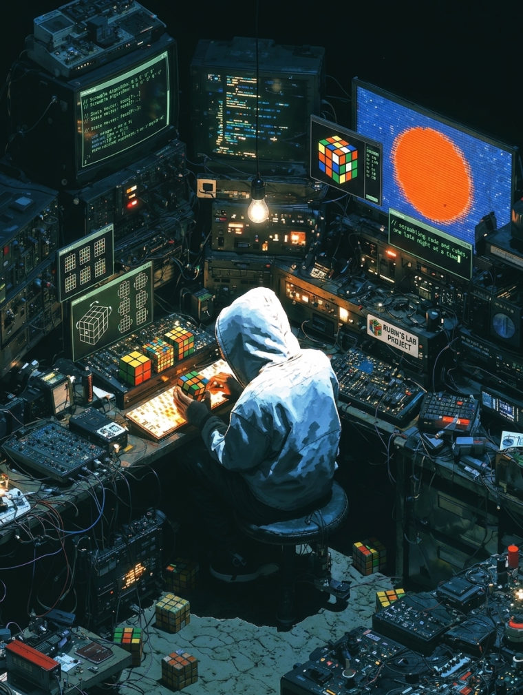

---

### 🧩 About me

<table>
<tr>
<td width="28%" valign="top">

**Hi there, I'm Ibrahim.**

I believe in a holistic approach to building products. Whether it's architecting a real-time distributed system, fine-tuning mobile performance, or integrating hardware telemetry, I love turning complex ideas into tangible realities.

**Current Focus** &rsaquo; Developing **[Zkt-Timer](https://github.com/ibrhyyme/Zkt-Timer)**, marrying smart-cube hardware with robust software for a next-gen solving experience.

**What drives me**

&rsaquo; Clean architecture that scales, not just "works" 
&rsaquo; Native-grade performance on every platform 
&rsaquo; Real products people actually use, not demos

</td>
<td width="34%" valign="middle" align="center">

</td>
<td width="38%" valign="top">

**The Complete Maker Stack**
 software is just where it starts

🎨 **Design &amp; Motion** 

📐 **CAD &amp; 3D** 

📊 **Data &amp; Finance** 

🔌 **Hardware &amp; IoT** 

⚙️ **Automation** 

</td>
</tr>
</table>

### 🛠️ Tech Stack

**Languages**

**Frontend**

**Backend**

**Data & Cache**

**Mobile**

**DevOps & Services**

**Platform & Tooling**

**🔭 Also explored** from the WCA / cubing open-source projects I've studied

### 🏆 Featured & GitHub Stats

<table>
<tr>
<td valign="top" width="46%">

**[Zkt-Timer](https://github.com/ibrhyyme/Zkt-Timer)**

A professional speedcubing timer with custom SSR, smart-cube Bluetooth, real-time rooms, and WCA integration. SSR web plus native iOS and Android, built from scratch.

</td>
<td valign="middle" width="54%">

</td>
</tr>
</table>

### 🐍 Contribution graph

  

---

`R U R' U'` &nbsp; • &nbsp; **Never stop scrambling** &nbsp; • &nbsp; `F R U R' U' F'`

 

